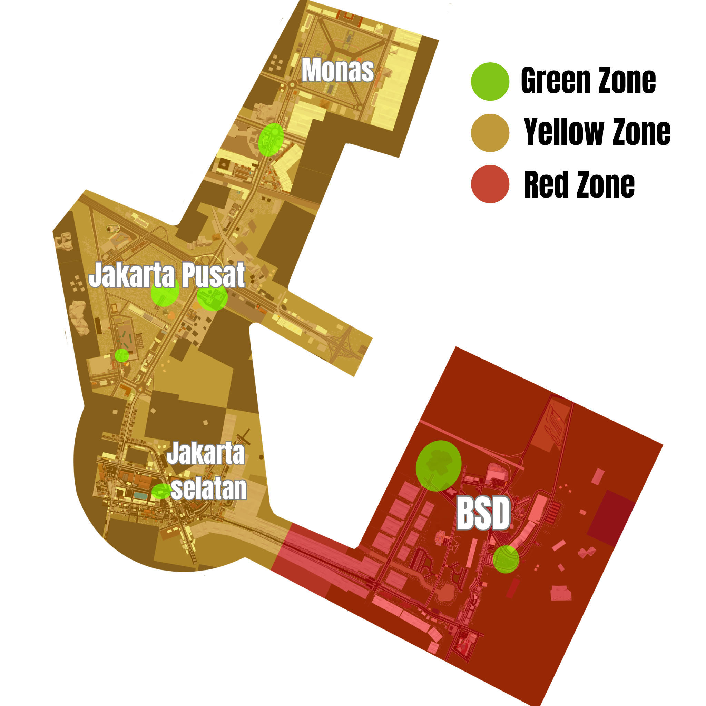

<link rel="shortcut icon" type="image/png" href="logo.png">

# 📜 Peraturan Kota Fullstate

## Daftar Isi
1. [BAB 1 - Peraturan Umum](#bab-1---peraturan-umum)
2. [BAB 2 - Norma Sosial & Interaksi](#bab-2---norma-sosial--interaksi)
3. [BAB 3 - Ketentuan & Wewenang Admin](#bab-3---ketentuan--wewenang-admin)
4. [BAB 4 - Ketentuan Fraksi & Pekerjaan](#bab-4---ketentuan-fraksi--pekerjaan)
5. [BAB 5 - Zona Kota](#bab-5---zona-kota)
6. [BAB 6 - Peraturan Bad Side](#bab-6---peraturan-bad-side)

---

## BAB 1 - Peraturan Umum

### 1.1 Istilah Umum Roleplay

#### **Roleplay**
Game roleplay adalah jenis permainan dimana pemain berperan sebagai karakter dalam sebuah cerita atau dunia fiktif. Dalam game ini, kamu tidak hanya bermain, tetapi juga "menjalani" kehidupan karakter tersebut. Permainan ini sangat membutuhkan kemampuan berkomunikasi yang baik. Memiliki adab dan mentaati norma-norma sosial yang baik juga sangat perlu dalam bermain game ini.

* **In Character (IC)**
  Di Dalam Karakter: Pemain berperilaku dan bertindak seolah-olah mereka benar-benar menjadi karakter yang mereka mainkan. Setiap pemain hanya boleh memiliki 1 karakter.
* **Out of Character (OOC)**
  Di Luar Karakter: Ketika pemain tidak lagi berada dalam karakter dan berkomunikasi sesuai dunia nyata.
* **Mixing**
  Melakukan RP dengan menggunakan informasi dari OOC atau melakukan pembahasan OOC di dalam RP.

#### **Kamus Dasar Roleplay**

| Istilah | Arti / Keterangan |
| :--- | :--- |
| **Badai** | Server Down |
| **Mengudara** | Server Up |
| **Kesantet** | Disconnect |
| **Satelit** | Jaringan / Koneksi Internet |
| **Keluar Kota** | Leave Game |
| **Masuk Kota** | Join Game |
| **Kota** | Game World |
| **Imigrasi** | Rejoin |
| **Website Biru** | Discord / Social Media |
| **Email** | Private Message / Direct Message |
| **Pingsan** | IC down / Unconscious |
| **Vlog** | Stream / Live Streaming |
| **Frp** | Fail Roleplay / Gagal Jadi Penduduk |
| **Bad side / Ormas** | Pekerjaan dari Kelompok Kriminal |
| **White List** | Pekerjaan EMS, Government, Polisi |
| **Arwah / Leluhur** | Diri OOC pemain |
| **Mata Merah** | IC Terkena Damage (Layar merah) |
| **Libur** | Banned sementara |
| **Deportasi** | Banned permanen |
| **CK** | Character Kill (Mati permanen) |
| **Pempus / Dewa** | Admin |
| **Mikir** | Loading aset |
| **Mantra** | Command (/me /do dll) |
| **Mainan** | Senjata Api |
| **Melambat** | Lagging / FPS Drop |

### 1.2 Peraturan Kota

> **Legenda Sanksi:**
> 🟨 **Warning** | 🟧 **Sanksi Ringan** | 🟥 **Sanksi Sedang** | 🟫 **Sanksi Berat/Deportasi**

* 🟧 **Mixing** *(Sanksi Ringan)*
  
  Melakukan RP dengan menggunakan informasi dari OOC atau melakukan pembahasan OOC di RP.
  > *Contoh: Memanggil nama OOC (nama asli pemain) ketika bermain di dalam kota.*

* 🟧 **Metagaming** *(Sanksi Ringan)*
  
  Menggunakan informasi yang didapat dari luar game (OOC) untuk memengaruhi keputusan atau tindakan In-Character (IC).
  > *Contoh: Mengetahui lokasi karakter lain dari Discord atau lainnya tanpa alasan IC, lalu menggunakannya untuk menyerang atau menghindari mereka.*

* 🟥 **Misuse/Abuse of Power** *(Sanksi Sedang)*
  
  Penyalahgunaan jabatan, otoritas, akses, atau privilege (baik In-Character maupun Out-of-Character) untuk mendapatkan keuntungan, mengontrol tindakan pemain lain, atau memaksa alur cerita di luar logika dan aturan roleplay.
  > *Contoh: Pemain menggunakan kewenangannya untuk menekan, mengancam, atau menghukum pemain lain tanpa dasar RP yang jelas.*

* 🟥 **Impersonating Whitelist Job** *(Sanksi Sedang)*
  
  Warga sipil atau badside dilarang keras menggunakan seragam, atribut, rompi, atau kendaraan yang identik dengan instansi resmi (Polisi, EMS, Government) untuk melakukan tindakan kriminal, menipu, atau membingungkan pemain lain.

* 🟫 **Looting Whitelist** *(Sanksi Berat)*
  * **Polisi & Government:** Dilarang mengambil barang milik instansi ketika *down*, **KECUALI** dalam kondisi **Perang** atau **Heist Besar** (Diperbolehkan mengambil Senjata, Cash, Makanan, Perban).
  * **EMS:** Dilarang keras melakukan looting terhadap EMS dalam kondisi dan situasi apapun (**Mutlak**).

* 🟫 **Bad Cop / Corrupt Gov** *(Sanksi Berat)*
  
  Anggota instansi dilarang menjual senjata dinas, informasi rahasia, atau bekerja sama dengan kriminal kecuali sudah memiliki **Bio Bad Cop** yang disetujui oleh Admin.

* 🟨 **Identify** *(Warning)*
  
  Saat player A mengenali player B tanpa berkenalan maka roleplay tersebut dianggap tidak sah / gagal.

* 🟥 **Kill on Sight (KOS)** *(Sanksi Sedang)*
  
  Menembaki warga dengan target atau tiba-tiba hingga pingsan dengan alasan yang tidak jelas, dilakukan hanya untuk kesenangan pribadi tanpa interaksi.

* 🟥 **Power Gaming** *(Sanksi Sedang)*
  
  Melakukan tindakan yang tidak masuk akal atau tidak realistis di dunia nyata. RP harus wajar sesuai logika manusia.
  > *Contoh: Menembak atau berbicara normal ketika kondisi pingsan (down).*

* 🟨 **Non Fear RP** *(Warning)*
  
  Kondisi dimana karakter tidak menunjukan rasa takut ketika ada di posisi yang mengancam nyawa.
  > *Contoh: Tidak takut/melawan ketika ditodong senjata api.*

* 🟧 **Force RP** *(Sanksi Ringan)*
  
  Memaksa kehendak roleplay kepada orang lain tanpa persetujuan lawan RP.
  > *Contoh: Memaksa RP ketika lawan sedang AFK/melamun.*

* 🟨 **NON BEHAVIOR RP** *(Warning)*
  
  Kondisi dimana karakter tidak memiliki tingkah laku yang wajar.
  > *Contoh: Menggendong orang sambil menyetir motor, Menguping dari balik tembok tebal, Polisi menembaki warga tanpa alasan.*

* 🟨 **Non-RP Driving** *(Warning)*
  
  Mengendarai kendaraan dengan cara yang tidak masuk akal secara fisika atau logika.
  > *Contoh: Sedan sport dipakai naik gunung terjal (offroad), melompat dari tebing tinggi lalu lanjut jalan.*

* 🟧 **CK (Character Kill)** *(Sanksi Ringan)*
  * CK hanya boleh dilakukan jika ada alasan IC yang kuat atau persetujuan OOC.
  * CK tidak boleh dipakai untuk melecehkan atau mengeksploitasi pemain.
  * Wajib persetujuan kedua belah pihak (Kecuali perintah pengadilan/pemerintah sah).
  * **Wasiat:** Semua aset IC (kecuali item donasi) harus dibuatkan surat wasiat.
  * **New Life Rule (NLR):** Karakter baru harus lupa ingatan tentang kematian karakter lama, tidak boleh kembali ke lokasi kematian, dan harus menjadi identitas baru total.

* 🟥 **Bug Abuse** *(Sanksi Sedang)*
  
  Memanfaatkan celah (glitch/bug) permainan untuk keuntungan pribadi tanpa melapor ke admin.

* 🟥 **Over Competitive** *(Sanksi Sedang)*
  
  Persaingan antar pemain yang melupakan alur RP dan hanya mementingkan "Menang vs Kalah".
  > *Contoh: Kelompok A kalah perang, lalu langsung menyerang balik Kelompok B tanpa jeda RP.*

* 🟥 **Revenge Kill** *(Sanksi Sedang)*
  
  Tindakan membuat karakter baru dengan tujuan khusus untuk membalas dendam terhadap karakter yang telah membunuh karakter kamu sebelumnya.
  > *Contoh: Membunuh karakter lain sebagai upaya pembalasan tanpa mempertimbangkan aspek roleplay yang masuk akal.*

* 🟨 **Evading RP** *(Warning)*
  
  Keluar dari permainan atau menghindari situasi roleplay tanpa alasan yang jelas, atau tanpa memberikan penjelasan memadai.
  > *Contoh: Sengaja "keluar kota" (disconnect) ketika sedang dibegal atau saat posisi ditangkap polisi.*

* 🟧 **RDM (Random Death Match)** *(Sanksi Ringan)*
  
  Menembaki warga secara random atau tiba-tiba hingga pingsan dengan alasan yang tidak jelas. Dilakukan hanya untuk kesenangan pribadi, tanpa didahului interaksi roleplay yang jelas.

* 🟫 **RMT (Real Money Trading)** *(Sanksi Berat)*
  
  Dilarang keras melakukan praktik jual beli barang, uang, atau aset dalam game menggunakan uang sungguhan (Rupiah).

* 🟫 **Pelecehan Seksual** *(Warning dan Deportasi)*
  
  Tindakan pelecehan seksual, verbal, atau intimidasi yang membuat pemain tidak nyaman (baik di Discord maupun IC) adalah terlarang. **Tidak ada alasan "hanya bercanda".**

* 🟧 **No Evac Roleplay** *(Sanksi Ringan)*
  
  Melakukan evakuasi teman yang *down* saat situasi perang/konflik masih aktif. Evakuasi hanya boleh dilakukan jika area sudah aman atau oleh EMS sesuai prosedur.

* 🟨 **Larangan Cross-Gender Roleplay** *(Warning)*
  
  Pemain wajib menggunakan karakter dengan gender yang sama dengan gender asli pemain.

* 🟧 **Flaming & Taunting** *(Sanksi Ringan)*
  
  Dilarang menggunakan kata-kata provokatif berlebihan atau tindakan toxic.
  > *Contoh: Menghina atau menembak mayat pemain yang sudah pingsan.*

* 🟥 **Oplas Tanpa Prosedur** *(Sanksi Sedang)*
  
  Mengganti wajah/identitas untuk menghindari konsekuensi hukum atau sosial tanpa prosedur EMS dan alur cerita yang jelas.

* 🟫 **Alting** *(Sanksi Berat - Deportasi)*
  
  Membuat karakter atau akun baru semata-mata untuk mendapat keuntungan curang.

### 1.3 Sanksi Administratif
1.  🟨 **Warning**: Dalam pengawasan admin. Jika berulang naik ke Sanksi Banding.
2.  🟧 **Sanksi Ringan**: Libur (Ban) 3 hari +/- Timeout Discord 1 hari.
3.  🟥 **Sanksi Sedang**: Libur (Ban) 7 hari +/- Timeout Discord 1 hari.
4.  🟫 **Sanksi Berat**: (Pelanggaran berulang 2x) Libur 30 Hari +/- Timeout Discord 7 hari.
5.  🟫 **Deportasi**: (Pelanggaran berulang 3x) Ban Permanen.

**Jam Efektif RP:**
Jam kotor dimulai setelah pukul 00.00 WIB dan jumlah warga kota dibawah 5. Prosedur EMS ketika treatment harus dilakukan sesuai prosedur.

---

## BAB 2 - Norma Sosial & Interaksi

### 2.1 Etika Berperilaku

* 🟨 **Respect dan Attitude** *(Warning)*
  
  Pemain wajib menghormati sesama pemain dan Admin. Jaga sopan santun baik IC maupun OOC.

* 🟨 **Cop Baiting** *(Warning)*
  
  Sengaja memancing aparat kepolisian untuk melakukan pengejaran atau tembak-menembak tanpa alasan roleplay yang jelas.
  > *Contoh: Sengaja drifting di depan kantor polisi atau menabrak mobil polisi yang diam agar dikejar.*

* 🟥 **Interaksi dengan Admin** *(Sanksi Sedang)*
  
  Wajib kooperatif saat diinvestigasi. Dilarang memalsukan bukti atau laporan. Keputusan admin bersifat mutlak.

* 🟨 **No Drama** *(Warning)*
  
  Dilarang membawa masalah pribadi atau drama ke dalam kota maupun Discord umum.

* 🟥 **Konten Dewasa atau NSFW** *(Sanksi Sedang)*
  
  Dilarang membagikan konten 18+ atau membahas topik seksual eksplisit.

* 🟫 **Doxing** *(Sanksi Berat)*
  
  Menyebarkan informasi pribadi (nama asli, alamat, foto, dll) pemain lain tanpa izin adalah pelanggaran berat.

### 2.2 Perlindungan Warga Baru (SKWB)

**Hak Warga Baru (7 Hari SKWB Aktif):**
* ✅ **Anti-Begal:** Tidak dapat dibegal. (Pelaku kena 🟧 *Sanksi Ringan*).
* ✅ **Modal Awal:** Uang IC Rp 50.000.000, makanan, dan minuman.
* ✅ **Diskon:** Potongan 50% untuk pembuatan SIM, SKCK, dan biaya Rumah Sakit.

**Larangan Warga Baru:**
* ❌ Dilarang bergabung dengan Bad Side / Ormas.
* ❌ Dilarang melakukan tindakan kriminal. (🟧 *Sanksi Ringan*).

---

## BAB 3 - Ketentuan & Wewenang Admin

* 🟥 **Wewenang & Keputusan Final** *(Sanksi Sedang)*

  Admin bertugas menjaga stabilitas server, kelancaran roleplay, dan menegakkan peraturan kota. Keputusan yang diambil oleh Admin adalah **MUTLAK dan FINAL**. Dilarang keras menentang, menantang, atau mengabaikan instruksi langsung dari Admin.

* 🟥 **Respect Kepada Admin & Attitude** *(Sanksi Sedang)*

  Seluruh pemain wajib menjunjung tinggi rasa hormat (*respect*) dan menjaga tata krama (*attitude*) yang baik saat berinteraksi dengan Admin, baik di dalam kota (In-Game) maupun di luar kota (Discord/OOC). Berperilaku toxic, merendahkan, menyindir kasar, atau menghina Admin akan ditindak tegas tanpa kompromi.

* 🟥 **Dilarang Berdebat (No Debat In-Game)** *(Sanksi Sedang)*

  Apabila Admin sedang menengahi suatu masalah atau memberikan sanksi secara langsung di dalam game, pemain **wajib mendengarkan dan patuh**. Dilarang keras berdebat panjang (debat kusir), ngeyel, memotong pembicaraan, atau adu argumen menggunakan Voice/Chat OOC di In-Game. Selesaikan dengan kepala dingin.

* 🟨 **Pause RP (Jeda Roleplay)** *(Warning / Sanksi Ringan)*

  Jika Admin mendatangi sebuah *scene* (situasi RP yang sedang aktif, seperti perang, begal, atau kejar-kejaran) dan menginstruksikan untuk **"Pause RP"**, maka seluruh tindakan karakter (menembak, berlari, looting, dll) **WAJIB dihentikan seketika**. Dilarang memanfaatkan momen *Pause RP* ini untuk kabur, mengatur posisi ulang, atau mencari keuntungan sepihak.

* 📋 **Prosedur Banding & Penggunaan Ticket** *(Wajib)*

  Jika pemain merasa dirugikan, tidak setuju dengan keputusan/sanksi, atau ingin melaporkan *Fail RP* pemain lain, pemain **tidak diizinkan** melakukan protes di In-Game atau di publik chat Discord.
  * Pemain **wajib** menggunakan sistem **Ticket** di Discord untuk melakukan pelaporan atau banding (*Appeal*).
  * Laporan/Banding **WAJIB** menyertakan bukti yang valid dan jelas. Protes atau laporan tanpa bukti konkret tidak akan diproses oleh Admin.

* 🟫 **Larangan Spam & Harassment** *(Sanksi Berat - Deportasi)*

  Dilarang keras melakukan spam chat, mengancam, memprovokasi, atau meneror (*harassment*) Admin melalui Direct Message (DM) pribadi terkait urusan kota, sanksi, atau permintaan *fast respond*. Semua keluhan, laporan, dan protes harus disalurkan secara terpusat dan profesional melalui jalur resmi (Ticket Discord). Tindakan teror/harassment kepada Admin memiliki toleransi nol (*Zero Tolerance*).

---

## BAB 4 - Ketentuan Fraksi & Pekerjaan

### 4.1 List Pekerjaan

| Kategori | Daftar Pekerjaan |
| :--- | :--- |
| **White List** | EMS, Government, Polisi, Silverduck (Taksi) |
| **Non-White List** | Pedagang, Penambang, Pemancing |
| **Bisnis / Legal** | Jakcloth, Paradise Pool, M Cafe, MCC, Corazen, Fnet |
| **Bad Side** | THT, BV, DWF |

### 4.2 Aturan Side Job

* 🟧 **Dual Side Job** *(Sanksi Ringan)*
  * Diperbolehkan: Bad Side + Non-Whitelist (Kecuali Mekanik & FNET).
  * Diperbolehkan: Gov + Bisnis Legal.
  * **Dilarang:** Mekanik atau FNET merangkap Bad Side.

* 🟧 **Cooldown Perpindahan Side (14 Hari)** *(Sanksi Ringan)*
  * **Whitelist ke Bad Side:** Wajib tunggu 2 minggu setelah resign.
  * **Bad Side ke Whitelist:** Wajib tunggu 2 minggu setelah keluar ormas.

### 4.3 Kategori Senjata

**Kepemilikan:** Warga sipil (dengan lisensi), Fraksi, dan Instansi (Polisi/Gov).

* **Kelas 1 (Ringan):** Golok, Baton, USP, Glock17/22, Taser (X26).
* **Kelas 2 (Menengah):** Revolver, MPX, MP5, MP7A1, MCX, TEC-9.
* **Kelas 3 (Berat):** AK47, M4 series, Shotgun (M870), Sniper (R700, Barret), Molotov.
  > *Catatan: Senjata Kelas 3 hanya digunakan atas persetujuan khusus/event.*

---

## BAB 5 - Zona Kota

*(Gambar: Peta Pembagian Zona Kota Fullstate)*

### 5.1 Green Zone *(Sanksi Sedang 🟥)*
*Area aman mutlak. Dilarang melakukan kriminal, provokasi, atau membawa senjata terbuka.*

* **Lokasi:** RS, Bandara (Spawn), Kantor Polisi, Kantor Gov, Silverduck, Area Kerja Legal (Tambang/Pemancingan).
* **Aturan:** Dilarang lari ke Green Zone saat dikejar (RP Pursuit) untuk berlindung.

### 5.2 Yellow Zone
*Wilayah sipil dengan keamanan tinggi. Polisi memiliki otoritas penuh.*

* **Lokasi:** Jakarta Selatan hingga Jakarta Pusat.
* **Aturan:**
  * Badside dilarang melakukan kriminal langsung terhadap Polisi (begal/tembak) tanpa alasan RP kuat.
  * Konflik harus memiliki eskalasi cerita yang jelas.
  * Provokasi verbal diperbolehkan dalam batas wajar.

### 5.3 Red Zone
*Wilayah risiko tinggi. Kriminalitas legal secara RP.*

* **Lokasi:** Daerah BSD (Kecuali area kerja legal) & Base Badside.
* **Aturan:**
  * Polisi wajib menyalakan sirine saat masuk.
  * Pemain yang masuk dianggap menyetujui risiko dibegal/ditembak.
  * **Pengecualian:** Dilarang menembak Gov/Fnet yang sedang bertugas (Duty) dan EMS baik duty maupun off duty.

---

## BAB 6 - Peraturan Bad Side

### 6.1 Penyanderaan 🟥 *(Sanksi Sedang)*
* **Syarat:** Minimal ada **3 Polisi** & **2 EMS** aktif di kota.
* **Rasio:** Jumlah penyandera = Jumlah Polisi (Misal: 3 vs 3).
* **Cooldown:** 6 Jam (Cek channel status).
* **High Profile:** Menyandera pejabat (Walikota/Kapolri) butuh izin Admin + Min. 6 Polisi & 3 EMS.
* **Tebusan:** Maksimal Rp 500.000.000 (Total).
* **Lokasi:** Dilarang melakukan penyanderaan di lokasi tidak realistis seperti base fraksi sendiri.
* **Larangan:**
  * Tidak boleh minta tebusan senjata.
  * Sandera harus diperlakukan manusiawi.
  * **Fake Hostage (Sanksi Berat):** Dilarang menggunakan teman sendiri atau sesama anggota kelompok sebagai "sandera pura-pura" demi keuntungan.

### 6.2 Pembegalan 🟧 *(Sanksi Ringan)*
* **Syarat:** Minimal **2 Polisi** & **1 EMS** aktif.
* **Looting Maksimal:**
  * Uang Cash: Rp 10.000.000 /orang.
  * Item: 100 hasil kerja, 10 makan/minum, 1 senjata mainan, 5 perban.
* **Larangan:**
  * Dilarang membegal Warga Baru (SKWB).
  * Dilarang membegal Gov/EMS on duty.
  * Cooldown 20 menit per aksi.

### 6.3 Konflik & Peperangan 🟥 *(Sanksi Sedang)*

**Perang Antar Fraksi:**
* Dilakukan di Yellow/Red Zone.
* Polisi hanya masuk jika salah satu fraksi kalah atau memberi peringatan 2x.
* **Senjata:** Default Kelas 2. Kelas 3 dibatasi (misal 1 sniper).
* **Aturan:** Dilarang *Return to Scene* (balik lagi setelah mati). EMS dilarang disentuh.

**Perang Polisi vs Fraksi:**
* Rasio pemain awal harus setara.
* Jika 10 menit tidak ada tembakan = Clear Area.
* **Senjata Polisi:** Default Kelas 2. Kelas 3 (Sniper/SWAT) hanya untuk High Risk.

**Aturan Tambahan Konflik:**
* **Camping RS/Spawn:** Dilarang menunggu di area RS atau spawn untuk kembali menyerang pemain yang baru sadar/hidup kembali.
* **Third Party (Sanksi Ringan):** Pihak ketiga yang tidak berkepentingan dilarang ikut campur dalam situasi roleplay perang yang sedang berlangsung.

### 6.4 Aturan Fraksi 🟨 *(Warning/Sanksi Ringan)*
* Ketua minimal 17 tahun (OOC). Anggota Max 15 orang.
* Base fraksi area privat. Fraksi memiliki kuasa tertinggi pada base masing-masing.
* Dilarang menyembunyikan RMT dibalik aktivitas fraksi 🟧 *(Sanksi Ringan)*.

### 6.5 Rules Robbery
* **Kelas 1:** Untuk RP perampokan kecil/mini market.
* **Kelas 2:** Diperbolehkan untuk eksekutor (bank, brankas besar).
* **Kelas 3:** Hanya untuk skenario besar yang sudah disetujui admin.

### 6.6 Aturan Ladang 🟨 *(Warning)*
* **Waktu Diperbolehkan:** Pukul 19.00 - 23.00 WIB (Waktu Internasional).
* Diperbolehkan meladang tanpa polisi dan ems.
* Senjata: Kelas 1, boleh naik ke Kelas 2.
* Diperbolehkan mengambil semua hasil ladang sampai habis.
* Ladang diperuntukan untuk seluruh fraksi.
* Polisi wajib menyalakan sirine ketika memasuki BSD.

### 6.7 Penyamaran & Intimidasi 🟧 *(Sanksi Ringan)*
* Diperbolehkan menarik "uang keamanan", ancam bisnis, intimidasi saksi.
* Gunakan senjata Kelas 1 (Pistol/Sajam) untuk intimidasi. Kelas 2 hanya jika eskalasi berat.

### 6.8 Aturan Kendaraan 🟥 *(Sanksi Sedang)*
* **Stealing Emergency Vehicle:** Mencuri kendaraan dinas (Mobil Polisi/Ambulans) tanpa alasan RP yang sangat mendesak adalah dilarang.
